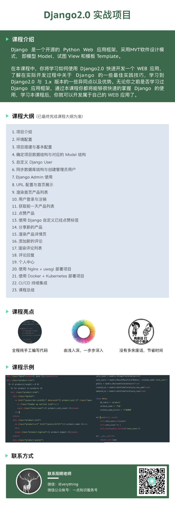

# productaste
基于 django2.0 快速实现一个产品分享的 WEB 应用

课程地址: [https://www.haimaxy.com/course/m12jop/](https://www.haimaxy.com/course/m12jop/?utm_source=github)

每节课的源码和`TAG`是同步的，比如第5节课对应的源码就是`TAG`为**lesson5**对应的源码。

[](https://www.haimaxy.com/course/m12jop/?utm_source=github)

## 构建 Nginx 镜像
首先确保已经安装`Docker`，进入`nginx`目录，将下面的`pt.django.conf`文件内部的**proxy_pass**更改为你本地的`Django`服务地址

```
server {
    listen 80;
    location / {
        proxy_pass http://192.168.31.9:8000;
        proxy_redirect default;
        proxy_set_header Host $host;
        proxy_set_header X-Real-IP $remote_addr;
        proxy_set_header X-Forwarded-For $proxy_add_x_forwarded_for;
        proxy_set_header X-Forwarded-Host $server_name;
    }
}
```

然后执行下面的镜像构建命令：
```
$ docker build -t mynginx:v1 .
```


